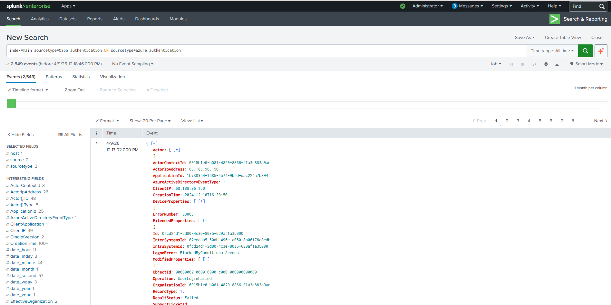
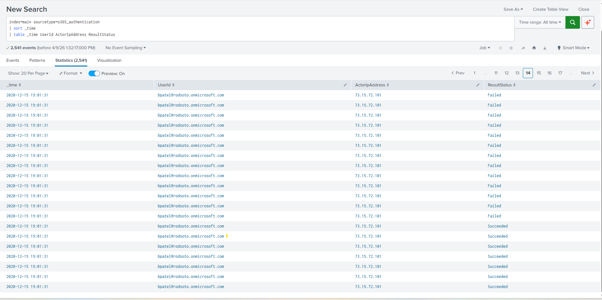
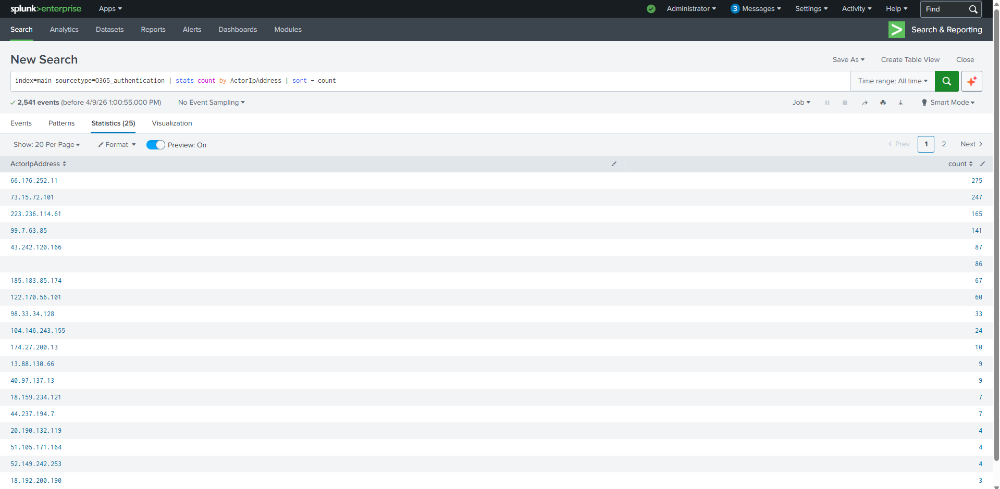
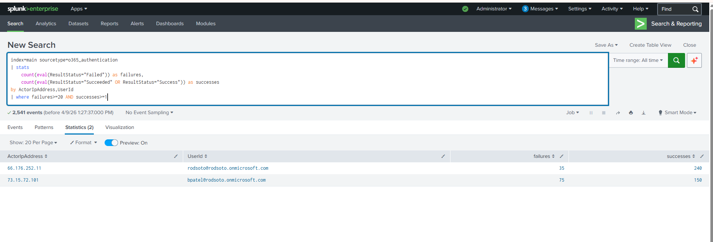
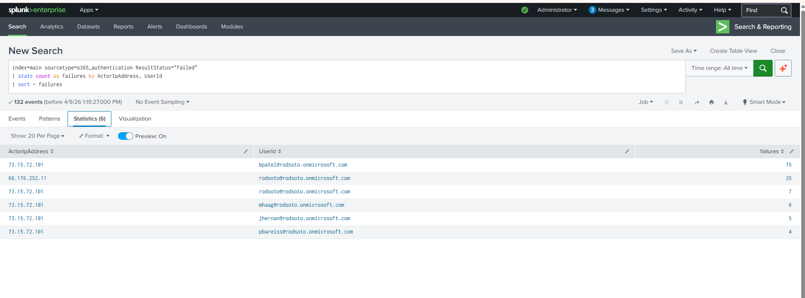
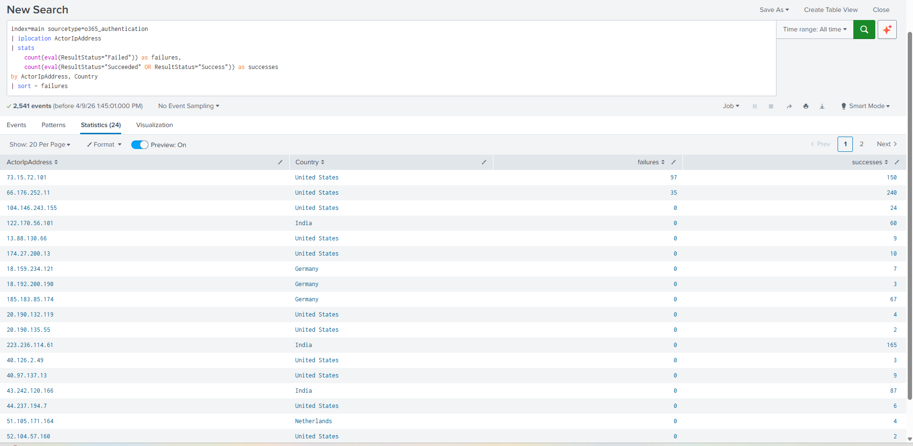
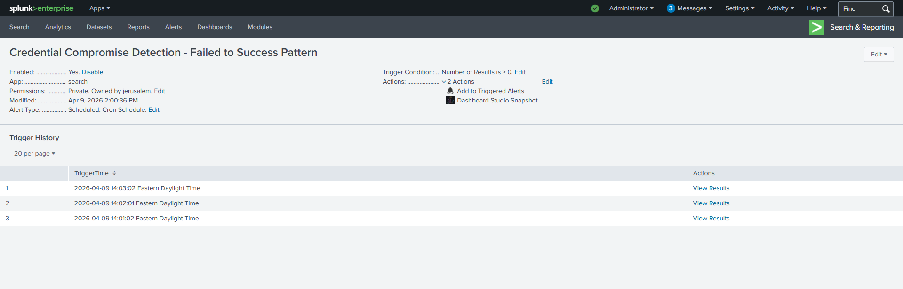

# Credential Compromise Detection in Splunk (O365 & Azure AD)

---

## Overview  

This project focuses on detecting credential compromise by analyzing authentication activity in a Splunk environment. The goal is to identify suspicious login behavior that may indicate an attacker has gained access to valid user credentials.

By analyzing patterns such as repeated failed logins, successful authentication after failures, and abnormal login locations, this project demonstrates how account takeover activity can be identified early in a SOC environment.

---

##  Investigation Evidence

### 1. Log Ingestion Validation

  

Validated ingestion and normalization of authentication logs from O365 and Azure AD.

**Key Insight:** Authentication logs are successfully ingested and ready for analysis.

---

### 2. Brute Force Detection (Failed Logins)

  

Identified repeated failed authentication attempts targeting specific user accounts.

**Key Insight:** A high volume of failed logins from a single source indicates brute force or password spraying activity.

---

### 3. Top Attacking Source IPs

  

Analyzed source IPs generating the highest number of failed authentication attempts.

**Key Insight:** Multiple login attempts from the same IP suggest coordinated targeting of user accounts.

---

### 4. Failed → Successful Login Pattern

  

Detected successful authentication events following multiple failed attempts.

**Key Insight:** This pattern strongly indicates credential compromise, where an attacker successfully gains access after repeated failures.

---

### 5. User & IP Correlation

  

Correlated user accounts with source IP addresses across authentication events.

**Key Insight:** Multiple users targeted from the same IP indicates coordinated attack behavior or password spraying attempts.

---

### 6. Geolocation Analysis

  

Analyzed geographic origin of authentication attempts.

**Key Insight:** Login attempts from unusual or unexpected locations indicate potential unauthorized access.

---

### 7. Alert Triggering

  

Detection logic triggered alerts based on defined thresholds and suspicious patterns.

**Key Insight:** Automated alerting enables early detection and response to credential compromise before further attack progression.

---

## Detection Logic Summary

The detection is built around identifying a sequence of authentication events that indicate potential credential compromise.

The logic correlates failed and successful login events based on user account and source IP address within a defined time window.

Detection conditions include:

- Multiple failed login attempts within a short period (brute force / password spraying behavior)
- A successful login occurring after repeated failures
- Authentication attempts originating from the same source IP
- Multiple user accounts targeted by a single IP address
- Login activity from unusual or high-risk geographic locations

This pattern reflects a common attack scenario where an attacker attempts multiple passwords and eventually gains access using valid credentials.

---

## Attack Scenario  
An attacker attempts to gain unauthorized access by repeatedly trying different password combinations against user accounts.

After multiple failed attempts, the attacker successfully logs in using valid credentials.

To maintain access and avoid immediate detection, the attacker:
- Performs repeated login attempts from a single IP  
- Successfully authenticates after multiple failures  
- Accesses accounts from unusual or unexpected locations  
- Generates authentication patterns that blend with normal activity  

The goal of this detection is to identify these behaviors early before further actions such as data access or lateral movement occur.

---

## Detection Focus  
- Repeated failed authentication attempts (brute force behavior)  
- Failed → successful login patterns (credential compromise indicator)  
- Suspicious source IP activity  
- User and IP correlation  
- Geolocation anomalies in authentication activity  

---

## Data Source  
- Microsoft 365 Authentication Logs  
- Azure Active Directory Authentication Logs  

---

## Detection Approach  

The detection was developed to reflect how authentication-based threats are identified in a real SOC environment:

1. Data Validation  
   Verified ingestion and structure of authentication logs across multiple sources  

2. Failed Login Analysis  
   Identified repeated authentication failures from specific IP addresses  

3. Source Analysis  
   Determined top source IPs responsible for failed login attempts  

4. Behavior Identification  
   Detected patterns where multiple failed attempts were followed by successful logins  

5. Correlation  
   Correlated user accounts, source IPs, and login outcomes across both O365 and Azure logs  

6. Geolocation Analysis  
   Analyzed login origins to identify unusual or suspicious access locations  

7. Alerting Logic  
   Triggered alerts when high-risk authentication patterns were detected  

---

## Key Findings  
- Multiple accounts experienced repeated failed login attempts from specific IP addresses  
- Successful authentication occurred after multiple failures, indicating possible credential compromise  
- Suspicious IPs were responsible for targeting multiple user accounts  
- Authentication activity originated from unexpected geographic locations  

---

## Alerting & Use Case  
Configured Splunk alerts to detect credential compromise patterns, enabling:

- Early identification of unauthorized access attempts  
- Faster investigation of suspicious login activity  
- Improved visibility into authentication-based threats  

---

## MITRE ATT&CK Mapping  
- T1110 – Brute Force  
- T1078 – Valid Accounts  

---

## Technologies & Tools  
- Splunk (Search & Reporting)  
- Microsoft 365 Logs  
- Azure Active Directory Logs  
- SPL (Search Processing Language)  

---

## Skills Demonstrated  
- Threat Detection 
- Threat Hunting  
- Authentication Log Analysis  
- Behavioral Correlation  
- SIEM Alert Development  
- Identity Threat Detection  

---

## Why This Project Matters  
Credential-based attacks are a common entry point for attackers and are often difficult to detect using basic monitoring.

This detection focuses on identifying behavioral patterns rather than isolated events, helping surface account compromise activity that may otherwise go unnoticed.

---

## Conclusion  

This project demonstrates how authentication-based detection can identify credential compromise early in the attack lifecycle. By leveraging log correlation, behavioral analysis, and alerting, security teams can proactively detect account takeover attempts before attackers can expand access or move laterally within the environment.

---

## Disclaimer  
This project was conducted in a controlled environment using simulated data for defensive security and detection engineering purposes.
